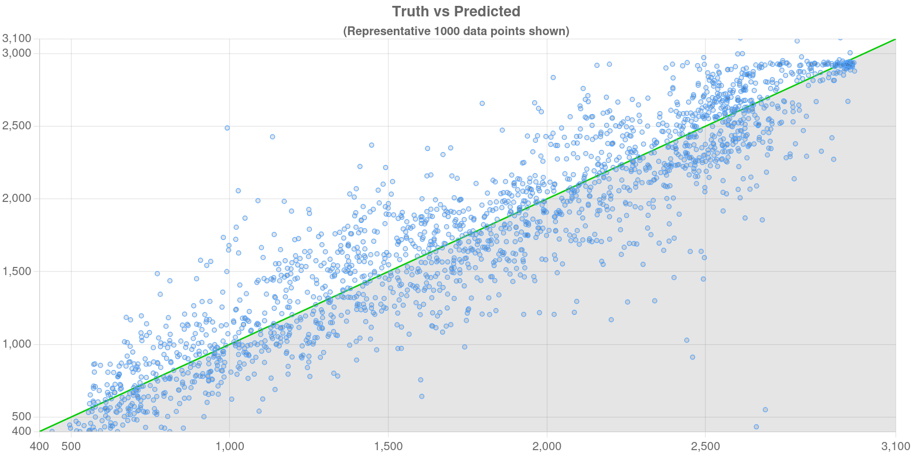
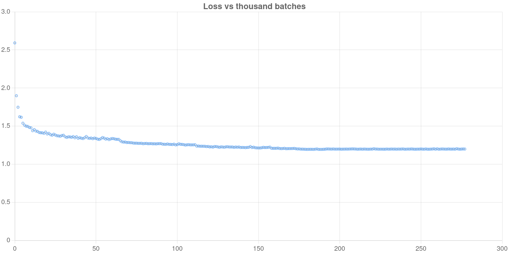

# Chess Elo Guesser

This is a summer project where I tried to make a model that can guess a chess player's rating from their games.

The main idea is that instead of just giving one rating at the end of a game, the model gives a probability distribution over rating ranges after every move. So you can actually watch the prediction change as the game goes on.

The project ended up becoming a lot bigger and messier than I originally planned. I spent a ridiculous amount of time dealing with PGN files, RAM, GPU drivers, model sizes, and trying things that absolutely did not work.

But it eventually got to a point where it was actually pretty good, so here it is.

## Results

On 10,000 unseen games with more than 30 half-moves:

| Metric | Result |
|---|---:|
| R² | 0.86 |
| RMSE | 277 Elo |

The model isn't remotely perfect, but it can learn a pretty strong relationship between the moves in a game and the rating of the player making them.

The predictions are also made throughout the game rather than only once at the end.

## How it works

Each position in the game gets converted into an 8×8×n representation.

The pieces have learned embeddings, and there are also embeddings for the board squares themselves. The current move is represented by highlighting the from-square and to-square with learned embeddings.

I originally tried using only the move-from and move-to information, but that went pretty badly. The model could learn things about openings and ended up relying on them way too much.

Adding the actual board representation made a pretty big difference.

The board then goes through a CNN which turns each position into a vector.

From there, the game is passed through LSTMs. White and Black are separated before the LSTM so that each model is looking at the moves made by that player rather than treating the entire game as one sequence.

This ended up working much better than feeding the whole game into one sequence. When I did that, the model had a tendency to predict roughly the same rating for both players, which made sense given how the dataset was distributed.

The final output is a probability distribution over 100-Elo rating ranges.

## Why a probability distribution?

This was one of the parts I struggled with quite a bit.

My first attempts were much more like normal regression/classification. I tried MSE and also tried making the rating into hard 100-Elo buckets.

Neither approach really felt right.

A player who is actually 1800 isn't necessarily meaningfully different from a player who is 1700, so making one bucket correct and the neighboring bucket completely wrong doesn't really represent what I wanted the model to learn.

I eventually searched online for other approaches to this problem and found HliasOuzounis's [Ai-Guess-the-elo](https://github.com/HliasOuzounis/Ai-Guess-the-elo) project.

That project gave me the idea to represent the player's rating as a probability distribution instead of a single hard target. I also directly took the idea of using KL-divergence loss and modeling the target as a normal distribution with a 200-point standard deviation.

So that part isn't something I'm claiming I came up with. I found the project when I was stuck with MSE and hard buckets and used that approach for my own model.

For my project, the target distribution is centered around the player's actual rating, with σ = 200.

The model is then trained with KL divergence between that target distribution and the distribution predicted by the model.

## Experiments that didn't work

A lot of the project was basically me trying something, realizing it didn't work, and then changing it.

At first I tried giving the model mostly the information about where the current move was played. That ended up learning openings more than actual playing strength.

I then tried a Transformer because it seemed like the obvious thing to try for a sequence of chess positions. It was way too expensive in VRAM for what I was doing, and it also naturally wanted to give me a whole-game representation rather than making the move-by-move predictions I wanted.

The LSTM worked much better for this.

I also tried feeding the entire game into one LSTM. That caused another weird problem where the model would often predict nearly the same Elo for both players.

Splitting the sequence by player fixed a lot of that.

Model size was another fun one.

I basically tried making the models as large as I could fit into VRAM, and then started making them smaller when that somehow made the results better. The largest model was not necessarily the best model. Some of the bigger ones would overfit openings or just drift towards predicting something close to the dataset average.

I didn't do a proper automated hyperparameter search. Most of the choices were made manually based on what I could fit into memory and what seemed to improve the results. I also tended to use convenient sizes like powers of two because, well, they were convenient.

## The data

The training data comes from the public Lichess game database.

A surprisingly large part of the project had nothing to do with neural networks and was instead me trying to get millions of chess games into a format that my computer could actually deal with.

The original PGNs were far too large to work with comfortably, so I spent a lot of time extracting, compressing, and converting the games.

I also made some decisions during preprocessing that seemed reasonable at the time and then later realized had thrown away information I needed.

zstd being single-threaded for the part of the pipeline I was using also made some of this much more annoying than it needed to be.

At one point I also lost several hours to AMD GPU driver problems.

So if parts of the data pipeline look slightly cursed, that's probably why.

## Evaluation

The final evaluation was done on 10,000 games that the model had not seen during training, with each game having more than 30 half-moves.

The model achieved an R² of 0.86 and an RMSE of 277 Elo.

Truth is y-axis, prediction is x-axis.

Loss is y-axis, thousand batches is x-axis.

## The web app

I also made a small web app for the project.

The backend was Flask, and I hosted it on AWS using the free credit that was available to me. It ended up running for around six months before I took it down.

My school eventually blocked the domain anyway, so that whole thing was kind of pointless.

The frontend is basic HTML and JavaScript. I also used a JavaScript library to call Kotlin functions, and a Kotlin library to load and run the PyTorch models.

None of this was chosen because it was some carefully designed architecture. I mostly picked whatever let me get the thing working without making my life even worse.

I also vibecoded a decent amount of the frontend.

## Android version

There is also an Android version of the project.

It works, but it isn't really optimized for older phones, so I wouldn't expect it to run particularly well on everything.

The main reason I made it was because I wanted to see if I could actually get the model running outside of my computer.

## Related work

One project that directly influenced part of this project was [HliasOuzounis/Ai-Guess-the-elo](https://github.com/HliasOuzounis/Ai-Guess-the-elo).

I found it after getting stuck with MSE and hard 100-Elo buckets and searching online for other ways to represent the target. That project gave me the idea to represent Elo as a probability distribution instead of a single value. I also used its approach of training with KL-divergence loss and using a normal distribution with a 200-point standard deviation for the target.

So I’m not claiming those parts as my own idea. I found that project, liked that approach, and used it for this project.

The rest of the architecture in this project came from my own experimentation with different ways of representing the board and processing the game move by move.

## What I would do differently

If I were starting this project again, I would probably spend much more time planning the data pipeline before training anything.

A lot of the early work was basically me trying things without really knowing where the project was going.

I also would have logged my experiments properly.

I didn't keep a perfect record of every model configuration and result. A lot of the information is still sitting around on my computer, but there isn't a beautiful Git history showing every step of the project.

I also wouldn't have tried to make the models as large as possible at the beginning. Bigger models were not automatically better, and in some cases they were much worse.

And I would definitely sort out the data format earlier. A ridiculous amount of time went into making the dataset fit in RAM.

## Limitations

The model was trained using standard Blitz games, so I haven't established how well it works on Bullet, Rapid, Classical, or chess variants.

The model is also trying to infer a player's rating from a single game, which is inherently noisy. A player can play much better or worse than their normal level in one particular game, and the opponent also affects the positions that occur.

The hyperparameter tuning was manual rather than a proper automated search.

The final evaluation is also just one evaluation setup, so the reported R² and RMSE shouldn't be treated as some universal measure of how accurately Elo can be predicted from chess games.

## Project structure

The repository contains the code for the model, data processing, experiments, and the applications built around it.

Some of the code is much messier than I would write it now.

This wasn't originally intended to become a polished research project. It started as a summer experiment and gradually got out of hand.

## Reproducing the project

Reproducing the exact training run isn't currently as simple as cloning the repository and running one command.

The dataset is large, the preprocessing pipeline went through several iterations, and some of the original experiments were done before I started organizing the project properly.

The code and models in this repository are mainly here to document what I built and how the final system works.

## Final thoughts

This project taught me a lot more about ML engineering than I expected.

The actual neural network was only part of the problem. Getting the data into a usable format, dealing with memory limitations, figuring out what the model was actually learning, and getting everything to run on different hardware ended up taking a huge amount of time.

A lot of the decisions were made because they seemed like the least painful option at the time.

Some of them worked.

Some of them really didn't.

But eventually I ended up with a model that can look at a chess game and make a somewhat reasonable estimate of the players' ratings while showing how that estimate changes throughout the game.

That's basically what I wanted when I started this project, even if I had absolutely no idea what I was getting myself into.

What a great summer.
